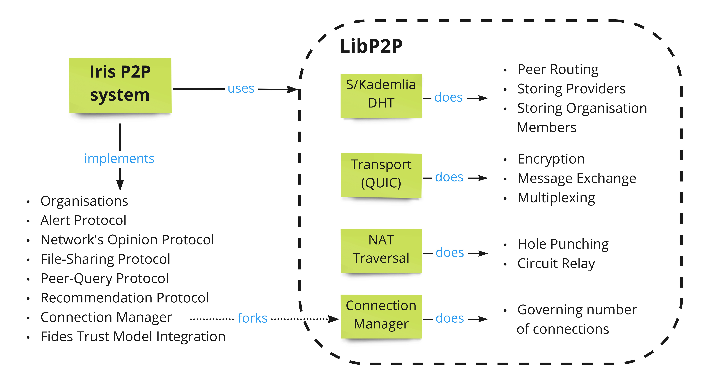
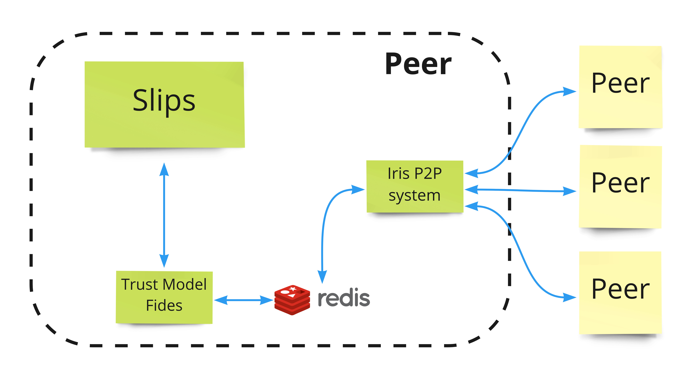

# Architecture, Implementation details

First, let me mention that taxonomy in the code-base slightly differs from the thesis as both parts
went through some progress. That's why, thesis talks about `service trust`, code-base refers to it as `reliability`. Also,
thesis talks about `Network Opinion Protocol`, code-base refers to it as `Intelligence Protocol`.

Iris is implemented in Go using LibP2P [LibP2P project](https://github.com/libp2p).
Check the following diagram to see division of responsibilities:



### Components in the Assumed System

* **Iris P2P System** - current repository
* [**Slips Intrusion Prevention System**](https://github.com/draliii/StratosphereLinuxIPS) - Slips (Python) is a central brain of all the detections. Slips uses Iris as a tool to communicate with other Slips instances
* [**Fides Trust Model**](https://github.com/lukasforst/fides) - Fides (Python) is a Trust Model designed simultaneously with Iris for highly adversarial networks. Fides is implemented as built-in module inside Slips.

See a diagram that depicts communication flow between the components:



Since Iris is implemented in Go and Fides is implemented in Python, only Fides directly interacts with Slips. Iris exchanges
messages only with Fides through Redis channel and with other peers. To see the defined message structure between Fides and Iris, see [iris-fides-msg-format.md](iris-fides-msg-format.md) file.

### Networking

As a transport layer Iris uses QUIC protocol (which runs on top of UDP)

### Core Protocols

Iris proposes and implements 3 core protocols to exchange threat intelligence data:
* Alert Protocol
* Intelligence Protocol (or Network Opinion Protocol)
* File Sharing Protocol

For details about these protocols we refer reader to see the text of the thesis.

### Auxiliary Behaviour/Protocols

Apart from the protocols mentioned on the thesis, Iris implements couple auxiliary protocols to enhance
proper functioning of the P2P network.

#### Peer Query Protocol

Peer Query Protocol is used by peers to exchange information about currently active peers in the network.
We think that such behaviour improves the decentralised nature of the network, because it slowly propagates
information about all peers in the network and thus peers can connect to a larger variability of peers.

#### Recommendation Protocol

Recommendation Protocol is required by Fides Trust Model. Fides Trust Model sometimes asks other peers on their opinion
on newly connected peers (for more theoretical details see the [Fides thesis](https://www.stratosphereips.org/thesis-projects-list/2022/3/12/trust-model-for-global-peer-to-peer-intrusion-prevention-system).
For more details see the [Iris-Fides message documentation](iris-fides-msg-format.md)

#### Connection Manager

Every peer has configured 3 values:
* **l - low water**
* **m - medium water**
* **h - high water**

If a peer has less then **low water** active connections, it triggers a connecting update procedure that tries to establish new connections so the peer has up-to **medium water** connections. The difference between **medium water** and **high water** is reserved for incoming connections.

If a peer happens to have more than **high-water** connections, the peer starts disconnecting from peers to keep only **medium-water** connections. First discarded peers are the one with smallest reliability (Except if the connection is made for DHT k-bucket lists. In that case we cannot disconnect from this peers for some time (for security reasons - otherwise an attacker could control our routing-table and we would be vulnerable to eclipse attack))


#### Organisation Member Updater

Iris periodically (period is configurable in yaml configuration file) queries the DHT to find members of organisations that
are trusted by local peer. 

### Peer Configuration

Iris requires a yaml configuration to run a peer. For all possible configuration fields, we refer a reader to see the source code of
[pkg/config/config.go](./../pkg/config/config.go) with all up-to-date fields. A small working example of the most important fields can be seen below:
```yaml
Identity:
  GenerateNewKey: true

Server:
  port: 9000
  Host: 127.0.0.1

Redis:
  Host: 127.0.0.1
  Tl2NlChannel: gp2p_tl2nl

Organisations:
  Trustworthy:
    - "12D3KooWErR8ZLhjAWYw4oj7gWLRPp99aupNU5HbFfVN9U12NBFZ"

PeerDiscovery:
  ListOfMultiAddresses:
    - "/ip4/127.0.0.1/udp/9001/quic 12D3KooWNxiCsZFyUFpLFNKDLEQDUK36my
       ifqufnnveK1jycMoJ8"
  DisableBootstrappingNodes: true
  ```
